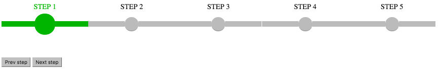

# feb-stepper [](https://travis-ci.org/FlemmingBehrend/feb-stepper)
Angular directive to visually show steps in a wizards etc. If it does not fit your needs you are welcome to fork and build your own version based on this.



##Usage
1. Type `bower install FlemmingBehrend/feb-stepper`
2. Add the css to your index.hxml with `<link rel="stylesheet" href="bower_components/feb-stepper/stepper.css">`
3. Add the script to your index.html with `<script src="bower_components/feb-stepper/stepper.js></script>`
4. Insert the directive into your html page  
```javascript
<feb-stepper 
    // An array of strings, each string transform to a new step
    // Supports {{stepText}} as string values.
    steps="['step1', 'step2']" 
    
    // The control object that is bound to the scope that the stepper is added
    // This is used to communicate between the controller and the directive (two ways)
    control="stepperControl"
    
    // The start step for stepper. The number will be the active step in the array of steps
    start-step="1">
</feb-stepper>
```
### Control object
You control the directives behavior though an object given in the control attribute. The object you need to give can be an empty object, but you need to keep a reference in the `$scope`of the controller. When the directive is linked, the object will be initialized and you can start using the following methods.  

* `nextStep()`  
This will make the current step completed and the next active. The operation will be ignored if the are no next step.
* `prevStep()`  
This will make the current step uncompleted and the previous is changed from completed to active.
* `setActiveStep(index)`  
This will set the specified index to an active step. Steps before index will be set to completed and steps after index will have their completed and active status cleared.  
Index can also be 0 (zero), this will clear all steps and there will be no active steps.
